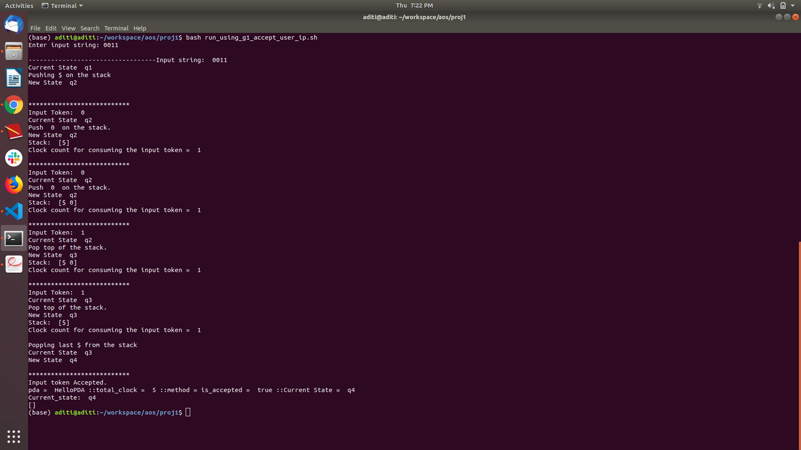
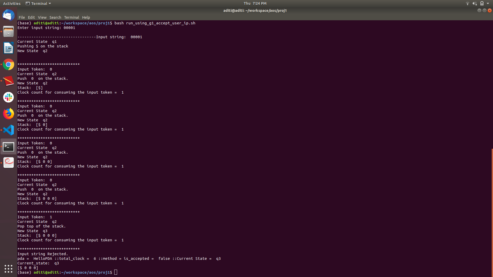

### Push Down Atomata in Go

#### Objectives

The objective of this assignment is to process the input string and to verify it against a PushDown Automata. The program requires the following:
- A JSON file which defines the grammar
- An optional text file consisting of the string to be processed. If this text file is not provided in the input, the program requires the user to provide the input through standard input.

The output of the program states if the provided string was accepted or rejected by the Push Down Automata. It also prints out all the intermediate stages that were taken while processing each input token.

#### How to run the program?

This is a Golang program that is run from the command line with the following command. As samples we have also added two PDA’s grammar1.json and grammar2.json.

#### Method 1:

Command to run a go program from command line

```
go run processor.go <grammar-file-name> <optional-input-file-name>

```

***Example:***

```
go run processor.go grammar1.json

```

```
go run processor.go grammar1.json input.txt

```

#### Expected Output:

- The command line asks for the input string to be entered by the user if the optional input file is not provided as an argument.
- After the input string is verified, it prints several steps taken by the PDA for consuming the input
string and final outcome of whether the input string is accepted or rejected.


### Method 2:

We have created a bash script that executes the program. It can be used as follows:

```
bash run_using_g1_accept_user_ip.sh

```

Expected Output:
- This bash script runs for grammar1.json.
- The command line asks for the input string to be entered by the user.
- After the input string is verified, it prints several steps taken by the PDA for consuming the input
string and final outcome of whether the input string is accepted or rejected.


### To run all test cases

```
bash​ ​run_script_with_all_test_cases.sh

```

Expected Output:
- This bash script runs for both grammar1.json and grammar2.json
- It consists of default test cases exhibiting standard output and standard error.


### Sample Screenshots




